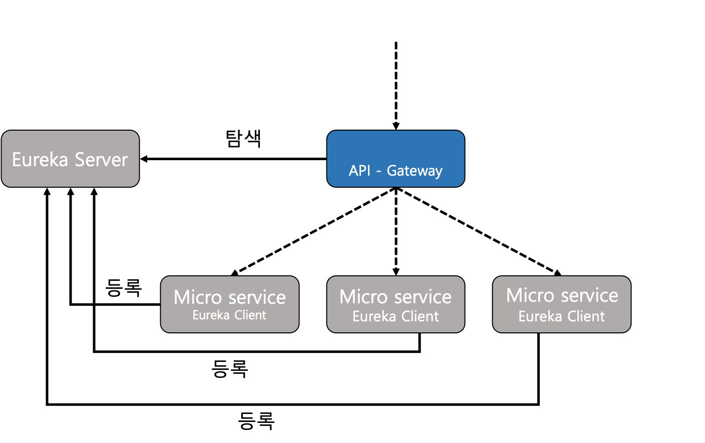
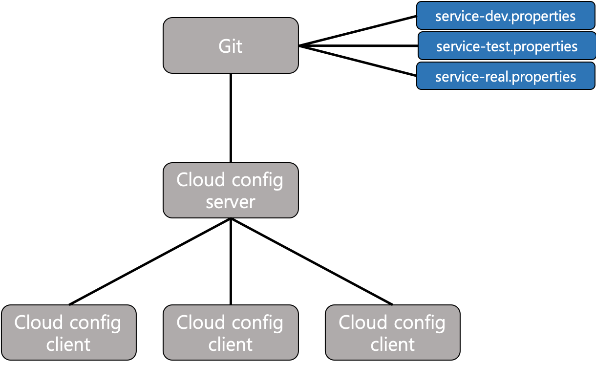
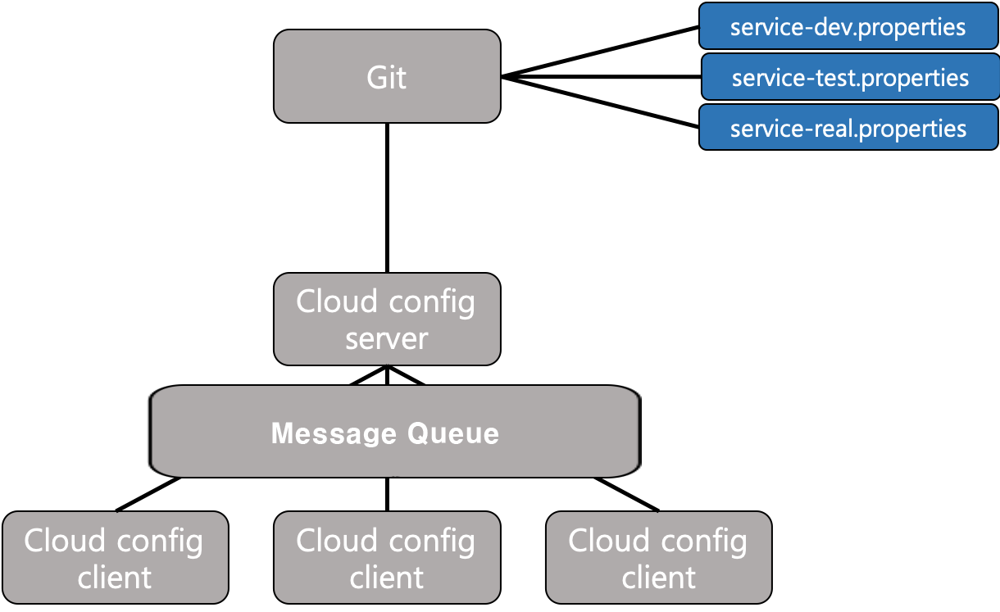

# Spring Cloud Config & Bus
- Spring Cloud Config와 Spring Cloud Bus에 대한 스터디 레포지토리

## 학습 목표
- MSA구조에서 .properties 또는 .yml파일을 공통으로 관리하는법과 메세지 큐를 이용하여 무중단 설정 관리 하는법에 대해서 알아볼수 있다.

## Spring Cloud Config 란?

[출처 : Spring공식홈페이지 - https://spring.io/projects/spring-cloud-config]

- Spring Cloud Config는 분산 시스템에서 외부화된 구성에 대한 서버 및 클라이언트 측 지원을 제공합니다. Config Server를 사용하면 모든 환경에서 애플리케이션의 외부 속성을 관리할 수 있는 중앙 위치가 있습니다. 애플리케이션이 개발에서 테스트 및 프로덕션으로 배포 파이프라인을 거치면서 이러한 환경 간의 구성을 관리하고 애플리케이션이 마이그레이션될 때 실행하는 데 필요한 모든 것이 있는지 확인할 수 있습니다.

## Spring Cloud Config 특징 

[출처 : Spring공식홈페이지 - https://spring.io/projects/spring-cloud-config]

- Spring Cloud Config Server 기능:
    * HTTP, 외부 구성을 위한 리소스 기반 API
    * 속성 값 암호화 및 암호 해독
    * Spring Boot 애플리케이션에 쉽게 임베드 가능 @EnableConfigServer
    
- Config Client 기능(Spring 애플리케이션용):
    * Config Server에 바인딩하고 Environment원격 속성 소스로 Spring을 초기화합니다.
    * 속성 값 암호화 및 암호 해독

## Spring Cloud Config 등장 이유
- 사전에 MSA에 대한 지식이 필요하다. MSA에 대해서 모른다면 해당 링크에서 학습하자 https://github.com/Developer-Choi-Jae-Young/MSATest

- 그렇다면 왜 Cloud Config라는 서비스 프레임워크가 등장했을까를 우리는 고민해볼 필요가 있다.
일단 Cloud Config라는 서비스 프레임워크가 존재하지 않는 세상에서의 MSA형태의 서비스 애플리케이션들은 각각 여러 구성요소들의 셋팅값이 존재할 것이다. 그림으로 표현하자면 대략적으로 아래 그림처럼 표현할수 있다.  
  
  [출처 : https://taes-k.github.io/2019/06/13/spring-msa-2/]
  
그림의 마이크로서비스들의 DB 연결정보가 모두 같다고 가정하고, 어느날 DB서버의 접속 주소가 달라진다고 하면 해당 마이크로서비스들의 애플리케이션 구성요소 셋팅값을 각각 바꿔줘야하는 번거로움이 존재하고, 실수로 모두 바꾸지 않는 경우에는 장애가 발생하기에 충분하기 때문이다. 해서 등장한것이 Cloud Config이다.   
  
## Spring Cloud Config 구조
- 해당 서비스의 구조는 아래 그림과 같다.  

  [출처 : https://taes-k.github.io/2019/06/13/spring-msa-2/]
  

## Spring Cloud Config만 사용했을 때의 한계
- Cloud Config 서비스 프레임워크 도입으로 인해 Git에서 모든 마이크로서비스 애플리케이션의 구성요소 셋팅값을 관리할수 있어졌으나, Git에 셋팅값을 바꾸게 되면 적용할 서비스를 재시작해야지 적용이 되는 단점이 존재 한다. 이와 같은 단점을 해결하고자 등장한 것이 Spring Cloud Bus이다.

## Spring Cloud Bus

[출처 : Spring공식홈페이지 - https://spring.io/projects/spring-cloud-bus]

- Spring Cloud Bus는 분산 시스템의 노드를 메시지 브로커와 연결합니다. 그런 다음 이를 사용하여 상태 변경 또는 기타 관리 지침을 브로드캐스트할 수 있습니다. AMQP 및 Kafka 브로커 구현이 프로젝트에 포함되어 있고 클래스 경로에서 발견된 모든 링크바인더는 전송으로 바로 작동합니다.  
  
  위내용을 좀 간추리면 분산 시스템을 메시지 브로커와 연결하여 해당 분산 시스템의 상태 변경시 즉시 전송하여 적용이된다 라고 볼수있다.

## Spring Cloud Bus 구조
- 해당 서비스의 구조는 아래 그림과 같다.  

  [출처 : https://taes-k.github.io/2019/06/13/spring-msa-2/]
  

## 브렌치별 설명
- ConfigServer
    * 관리할 .properties 또는 .yml파일들
- ClientNoBus
    * Spring Cloud Config Client 즉 MSA에서 마이크로서비스에 해당한다. (Spring Cloud Bus 미사용)
- ClientUseBus
    * Spring Cloud Config Client 즉 MSA에서 마이크로서비스에 해당한다. (Spring Cloud Bus 사용)
- server
    * Spring Cloud Config Server 애플리케이션